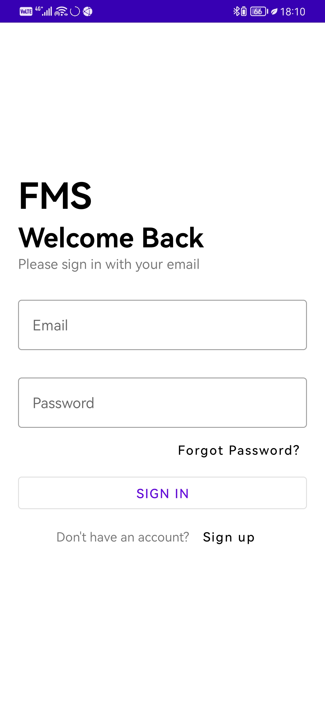

# fms-project
Football Management System

<table>
  <tr>
    <td></td>
    <td></td>
    <td></td>
  </tr>

 <tr>
    <td></td>
    <td></td>
    <td></td>
  </tr>

 <tr>
    <td></td>
    <td></td>
    <td></td>
  </tr>

 <tr>
    <td></td>
    <td></td>
  </tr>
 </table>